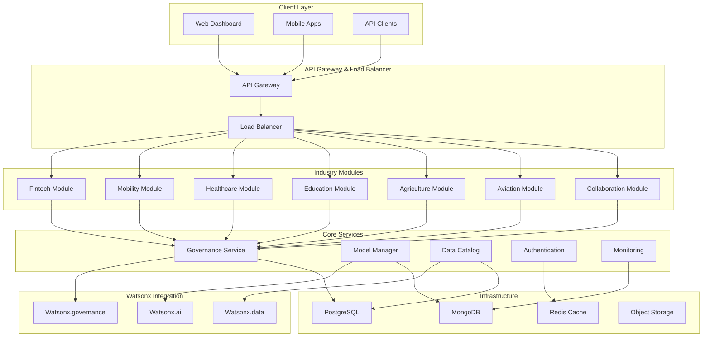

# Design Document

## Overview

The Watsonx-Powered Multi-Industry AI Innovation Hub is designed as a cloud-native, microservices-based platform that demonstrates enterprise-grade AI implementations across seven industry verticals. The architecture emphasizes modularity, governance-first principles, and cultural resonance through integrated SVG design systems.

The platform serves as both a technical showcase and production-ready solution, with each industry module operating independently while sharing common infrastructure for data governance, model management, and user experience consistency.

## Architecture

### High-Level Architecture



### Deployment Architecture

The platform supports three deployment levels:

**Level 1 (MVP)**: Single repository per industry module with integrated backend, ML, and UI components
**Level 2 (Scalable)**: Split repositories with separate concerns (backend, frontend, ML, infrastructure)
**Level 3 (Enterprise)**: Full microservices with container orchestration, CI/CD pipelines, and infrastructure as code

## Components and Interfaces

### Core Platform Components

#### 1. API Gateway
- **Technology**: Kong or AWS API Gateway
- **Responsibilities**: Request routing, rate limiting, authentication, CORS handling
- **Interfaces**: 
  - REST endpoints for all industry modules
  - GraphQL endpoint for complex queries
  - WebSocket support for real-time features

#### 2. Industry Module Framework
Each industry module follows a standardized structure:

```typescript
interface IndustryModule {
  name: string;
  version: string;
  endpoints: ModuleEndpoint[];
  models: AIModel[];
  datasets: Dataset[];
  governance: GovernanceConfig;
  ui: UIConfig;
}

interface ModuleEndpoint {
  path: string;
  method: 'GET' | 'POST' | 'PUT' | 'DELETE';
  handler: Function;
  auth: AuthConfig;
  rateLimit: RateLimitConfig;
  governance: GovernanceRule[];
}
```

#### 3. Governance Service
- **Technology**: Node.js/Express with TypeScript
- **Database**: PostgreSQL for audit trails, Redis for caching
- **Key Features**:
  - Real-time bias detection
  - Explainability dashboard generation
  - Compliance template management
  - Audit trail logging

```typescript
interface GovernanceService {
  detectBias(modelId: string, predictions: Prediction[]): BiasReport;
  generateExplanation(modelId: string, input: any): Explanation;
  logDecision(decision: AIDecision): void;
  validateCompliance(moduleId: string, regulation: string): ComplianceReport;
}
```

### Industry-Specific Components

#### Fintech Module
- **Credit Scoring Engine**: ML models for credit risk assessment
- **Fraud Detection**: Real-time transaction monitoring
- **Regulatory Compliance**: GDPR, PCI-DSS compliance checks
- **UI Components**: Transaction flows, risk dashboards, wallet interfaces

#### Mobility Module  
- **Demand Forecasting**: Time-series prediction models
- **Route Optimization**: Graph-based pathfinding algorithms
- **Real-time Tracking**: WebSocket-based location updates
- **UI Components**: Interactive maps, trip booking flows, driver dashboards

#### Healthcare Module
- **DSM-based Triage**: Symptom classification using DSM-5 criteria
- **Multilingual Chatbot**: NLP models supporting English, Swahili, French
- **Patient Data Management**: HIPAA-compliant data handling
- **UI Components**: Symptom checker, appointment booking, patient portals

#### Education Module
- **AI Tutor**: Personalized learning path generation
- **Governance Simulator**: Interactive compliance training
- **Progress Tracking**: Learning analytics and reporting
- **UI Components**: Course interfaces, progress visualizations, assessment tools

#### Agriculture Module
- **Yield Prediction**: Crop forecasting using weather and soil data
- **Supply Chain Traceability**: Blockchain-based tracking
- **Market Analysis**: Price prediction and trend analysis
- **UI Components**: Farm dashboards, crop monitoring, market insights

#### Aviation Module
- **Safety Audit AI**: Automated compliance checking
- **Drone Traffic Optimization**: Airspace management algorithms
- **Maintenance Prediction**: Predictive maintenance scheduling
- **UI Components**: Flight corridors, safety dashboards, maintenance schedules

#### Collaboration Module
- **Meeting Summarization**: NLP-based content extraction
- **Real-time Translation**: Multi-language support
- **Action Item Tracking**: Task management integration
- **UI Components**: Meeting interfaces, translation overlays, collaboration tools

## Data Models

### Core Data Models

```typescript
// User and Authentication
interface User {
  id: string;
  email: string;
  roles: Role[];
  preferences: UserPreferences;
  createdAt: Date;
  lastLogin: Date;
}

interface Role {
  name: string;
  permissions: Permission[];
  modules: string[];
}

// AI Models and Predictions
interface AIModel {
  id: string;
  name: string;
  version: string;
  moduleId: string;
  type: 'classification' | 'regression' | 'nlp' | 'computer_vision';
  status: 'training' | 'deployed' | 'deprecated';
  metrics: ModelMetrics;
  governance: ModelGovernance;
}

interface Prediction {
  id: string;
  modelId: string;
  input: any;
  output: any;
  confidence: number;
  explanation: Explanation;
  timestamp: Date;
  userId?: string;
}

// Governance and Compliance
interface GovernanceRule {
  id: string;
  name: string;
  type: 'bias_detection' | 'explainability' | 'compliance' | 'audit';
  config: any;
  isActive: boolean;
}

interface AuditLog {
  id: string;
  action: string;
  userId: string;
  moduleId: string;
  modelId?: string;
  details: any;
  timestamp: Date;
  ipAddress: string;
}

// Dataset Management
interface Dataset {
  id: string;
  name: string;
  description: string;
  moduleId: string;
  schema: DataSchema;
  governance: DataGovernance;
  location: string;
  size: number;
  lastUpdated: Date;
}

interface DataGovernance {
  classification: 'public' | 'internal' | 'confidential' | 'restricted';
  retention: RetentionPolicy;
  access: AccessPolicy;
  compliance: ComplianceRequirement[];
}
```

### Industry-Specific Data Models

```typescript
// Fintech
interface CreditApplication {
  id: string;
  applicantId: string;
  amount: number;
  purpose: string;
  financialData: FinancialProfile;
  riskScore?: number;
  decision?: 'approved' | 'rejected' | 'pending';
  explanation?: string;
}

// Healthcare
interface TriageSession {
  id: string;
  patientId: string;
  symptoms: Symptom[];
  severity: 'low' | 'medium' | 'high' | 'critical';
  recommendations: string[];
  language: 'en' | 'sw' | 'fr';
}

// Agriculture
interface CropPrediction {
  id: string;
  farmId: string;
  cropType: string;
  plantingDate: Date;
  expectedYield: number;
  confidence: number;
  factors: YieldFactor[];
}
```

## Error Handling

### Error Classification

```typescript
enum ErrorType {
  VALIDATION = 'VALIDATION',
  AUTHENTICATION = 'AUTHENTICATION',
  AUTHORIZATION = 'AUTHORIZATION',
  MODEL_ERROR = 'MODEL_ERROR',
  DATA_ERROR = 'DATA_ERROR',
  GOVERNANCE_VIOLATION = 'GOVERNANCE_VIOLATION',
  EXTERNAL_SERVICE = 'EXTERNAL_SERVICE',
  SYSTEM_ERROR = 'SYSTEM_ERROR'
}

interface APIError {
  code: string;
  type: ErrorType;
  message: string;
  details?: any;
  timestamp: Date;
  requestId: string;
  module?: string;
}
```

### Error Handling Strategy

1. **Graceful Degradation**: When AI models fail, provide fallback responses
2. **Circuit Breaker Pattern**: Prevent cascade failures in microservices
3. **Retry Logic**: Exponential backoff for transient failures
4. **Error Monitoring**: Real-time alerting and logging
5. **User-Friendly Messages**: Localized error messages in multiple languages

### Governance Error Handling

- **Bias Detection Failures**: Log incidents, disable model temporarily
- **Compliance Violations**: Immediate alerts, audit trail creation
- **Explainability Issues**: Fallback to simpler explanation methods
- **Data Privacy Breaches**: Automatic incident response workflows

## Testing Strategy

### Testing Pyramid

#### Unit Tests (70%)
- Individual function testing
- Mock external dependencies
- Test coverage target: 90%
- Technologies: Jest, Mocha, PyTest

#### Integration Tests (20%)
- API endpoint testing
- Database integration
- External service mocking
- Technologies: Supertest, TestContainers

#### End-to-End Tests (10%)
- Full user journey testing
- Cross-module interactions
- Performance testing
- Technologies: Playwright, Cypress

### AI Model Testing

```typescript
interface ModelTestSuite {
  accuracy: AccuracyTest;
  bias: BiasTest;
  performance: PerformanceTest;
  explainability: ExplainabilityTest;
  robustness: RobustnessTest;
}

interface BiasTest {
  protectedAttributes: string[];
  fairnessMetrics: FairnessMetric[];
  thresholds: BiasThreshold[];
}
```

### Governance Testing

- **Compliance Validation**: Automated checks against GDPR, HIPAA, KCAA requirements
- **Audit Trail Verification**: Ensure all decisions are properly logged
- **Explainability Testing**: Verify explanation quality and consistency
- **Data Privacy Testing**: Validate data anonymization and access controls

### Cultural Design Testing

- **Accessibility Testing**: Screen reader compatibility, color contrast
- **Localization Testing**: Multi-language support validation
- **Cultural Sensitivity**: Review of visual elements and messaging
- **Performance Testing**: SVG rendering performance across devices

### Deployment Testing

- **Level 1 Testing**: Single-container deployment validation
- **Level 2 Testing**: Multi-service integration testing
- **Level 3 Testing**: Full microservices orchestration testing
- **Infrastructure Testing**: Terraform plan validation, security scanning

### Continuous Testing Strategy

1. **Pre-commit Hooks**: Code quality and basic tests
2. **CI Pipeline**: Full test suite execution
3. **Staging Environment**: Integration and E2E testing
4. **Production Monitoring**: Real-time performance and error tracking
5. **A/B Testing**: Model performance comparison in production